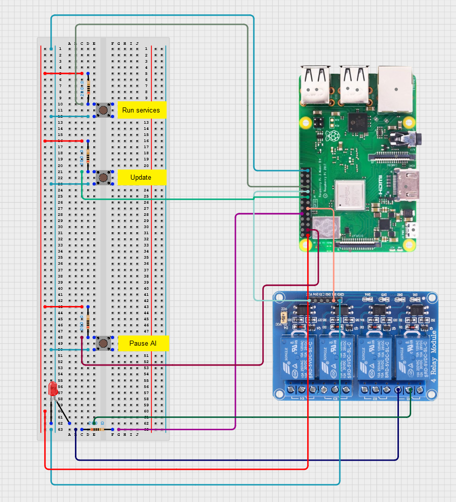

# Project 4.0 AI part

## Hardware setup
Follow the circuit schematic in order to set up the hardware for the Orange pi.

## How to RUN the hardware and AI container
After setting up the hardware, you need to access the cli (Command Line Interface) of the Orange pi. This can be done in multiple ways like using PuTTY to get access through SSH, using SFTP plugin in Visual Studio code which also uses SSH but more visually using the Visual Studio code environment and SFTP to grand a easy access to the files, or you can just plug in a keyboard, a mouse, and a monitor in order to access it also a regular computer.

Then you reach the cli of the Orange pi, you need to copy all the files provided on the Orange pi. Again, this can be done in multiple ways like using a USB stick to move the files, using SFTP, or uploading the files to a repository and downloading them to the Orange pi.

Using the cli, navigrate to the location of the files and find a file called ***start.sh***. You active directory in the cli should be set to the location of that file. Open the ***start.sh*** file and edit is based on the instruction in the file. Do NOT forget to save the changes.

Next, run the ***start.sh*** script by using the command `sudo bash start.sh`. This script is going to automatically set up all the necessery parts and going to start the application that operates the hardware and AI.

While the ***start.sh*** script is running, there is one spot were you will need to do something and that is during the docker installation. After Docker is installed it runs a test container that needs to be exited out of which can be done by using a command `exit`.

## Application testing data
Videos used for testing tracking of the application can be found in the directory test_data. It containes videos of digitally marked Asian hornets and regular Asian hornets.

## AI Development
More information about the AI model and its training can be found in the [README.md](YOLO_model/README.md) file in the directory YOLO_model.
